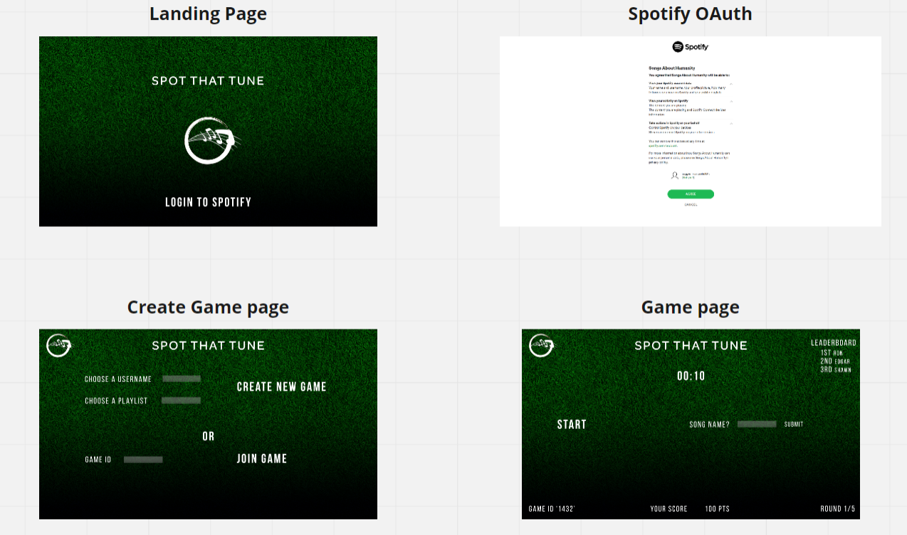
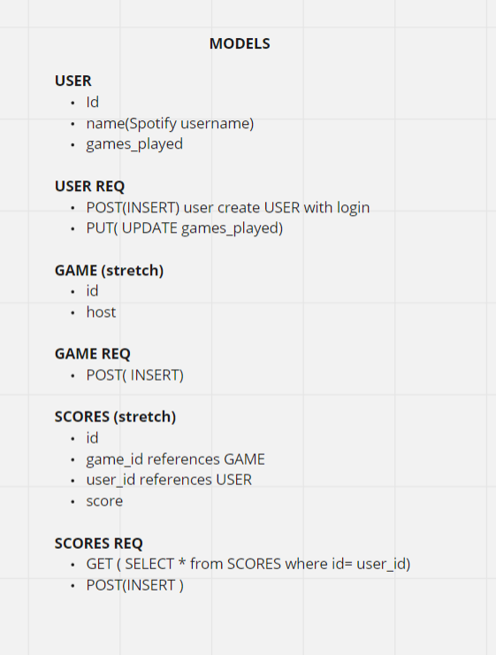

# Spot That Tune
Multiplayer "Guess that Song" game using Spotify Web API and Socket.IO.

# Members

Edgar Cuellar
Shawn Carpenter
Ron Yonker

# Wireframes

# User Stories

## User Story Host
* As a host, I want to be able create a room
* As a host, I want to select a playlist for the game
* As a host, I want to start the round
## User Story Player
* As a player, I want to join a created game
* As a player, listen to song simultaneously
* As a player, I want to guess the song name
* As a player, I want to see the scores of current  game
* As a player, I want to see the answer at the end of the round
* As a player, I want to see remaining time of round
* As a player, I want to see progress of game(rounds)
## User story Site Visitor (not logged in)
* As a site visitor, I want to view high-scores
* As a site visitor, I want to view About me
* As a site visitor, I want to view instructions

# Domain Modeling

# Database Entity-Relationship-Diagram

